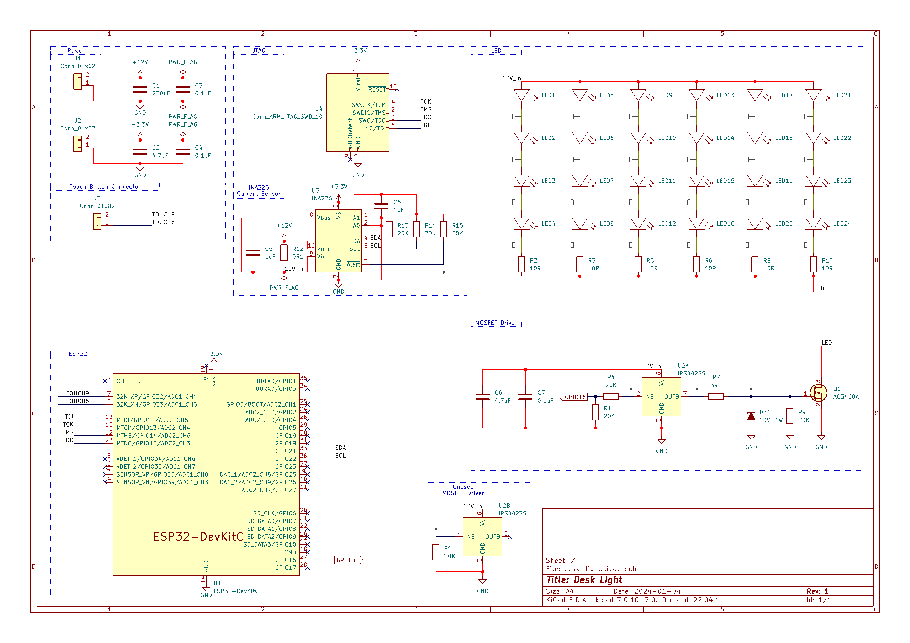
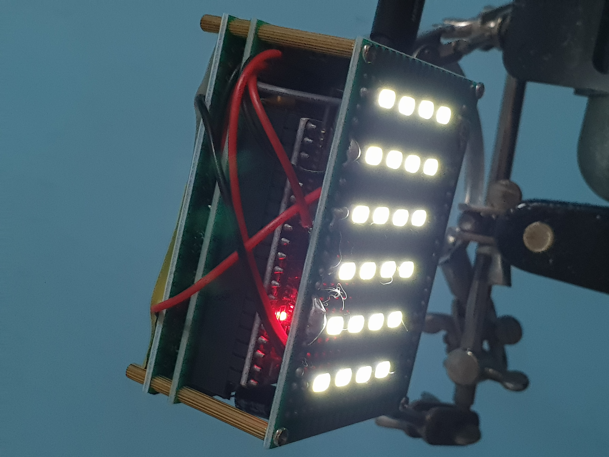
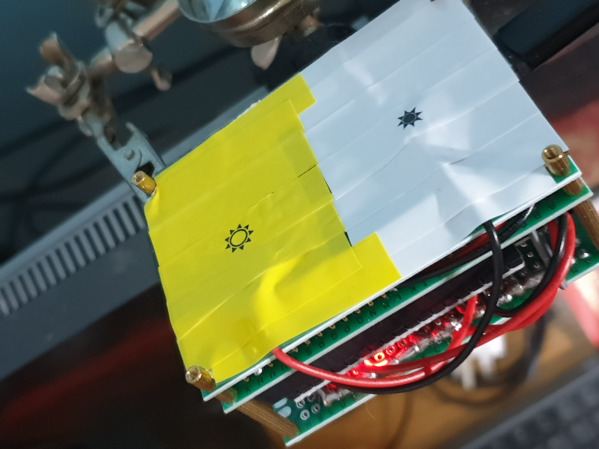

# Matter ESP32 Project

This project creates a Matter-capable PWM-controlled light, that can be controlled using capacitive buttons or using Home Assistant/Apple HomeKit/Google Home through Matter API.

## Setup
1. connectedhomeip (aka Matter) repository is already properly configured and working on your ubuntu machine.
2. Create third_party folder softlink to matter repository
```bash
ln -s ${HOME}/esp/connectedhomeip ./third_party
```
3. Set up environment
```bash
source ~/esp/esp-idf/export.sh
export IDF_CCACHE_ENABLE=1
source ~/esp/connectedhomeip/scripts/activate.sh
```
4. Build project
```bash
idf.py flash monitor
```
5. Commission the matter device as per normal according to Home Assistant/Apple HomeKit/Google Home Matter device onboarding procedures.
A Matter controller/router must already be setup beforehand in your home network.


Manual pairing code: `10596512353`

## Electrical Schematic



## Prototype
<p align="middle">
  
  
</p>

Prototype using a power delivery chip to supply 12V to power the IRS4427S MOSFET driver, and 24 (4S6P) 5730 LEDs. A buck converter steps down the voltage to 5V to power the ESP32. The AMS1117 voltage regulator on the ESP32 DevKitC board further steps down the voltage to 3.3V to power the INA226 power monitoring module. 

## Erase NVS storage to clear WIFI credentials

```bash
esptool.py erase_region 0x10000 0xD000
```

## Matter ZAP

Matter ZAP files are used to create the endpoints and clusters on the device.

# Create ZAP

1. Start ZAP Tool

```
${HOME}/esp/connectedhomeip/scripts/tools/zap/run_zaptool.sh
```

2. Create Endpoint 0 with Matter Root Node
3. Create Endpoint 1,2,3,... for the actual device
4. File -> Save As -> Choose Project/Common Folder to save at -> Filename should end with `.zap`

## Edit ZAP

```
${HOME}/esp/connectedhomeip/scripts/tools/zap/run_zaptool.sh $PATH_TO_ZAP_FILE
```

# Create Matter

```
${HOME}/esp/connectedhomeip/scripts/tools/zap/generate.py $PATH_TO_ZAP_FILE
```

# Code Pre-generate (Optional)

## Running pre-generate

- Change --input-glob `*matter-desk-light-app*` to the filename of `.zap` and `.matter`
- Change --external-root to parent directory of `.zap` and `.matter` files

```
${HOME}/esp/connectedhomeip/scripts/codepregen.py --input-glob "*matter-desk-light-app*" --input-glob "*controller-clusters*" --input-glob "*protocol_messages*" --external-root ${HOME}/Documents/ESP-IDF_Projects/matter-desk-light/ ${OUTPUT_DIRECTORY:-./zzz_pregenerated/}
```

# Matter Setup

[Building Matter](https://project-chip.github.io/connectedhomeip-doc/guides/BUILDING.html)

# ESP-IDF Setup

[Building ESP-IDF](https://docs.espressif.com/projects/esp-idf/en/latest/esp32/get-started/linux-macos-setup.html)

# Environment

Tested on:
OS: Ubuntu 22.04
*Note* Matter can only be built on linux systems.
ESP-IDF v5.2 Beta 2

- GCC 13.2
- GNU++23
- GNU17
